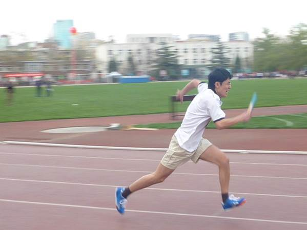
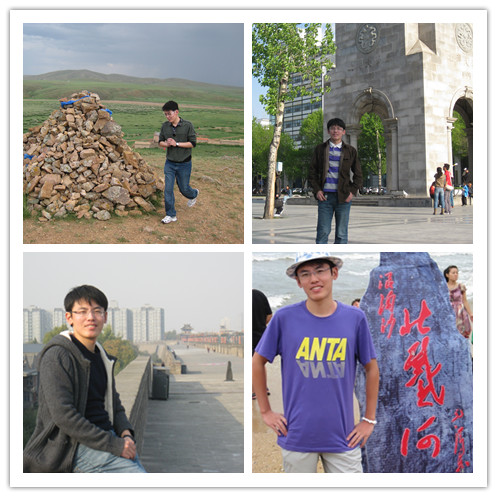

***

## Coding Ability

My undergraduate and master career mainly covered courses in computer science, such as assembly language, C++, Java and JSP, data structure, and database design. Currently I focus on R, Python, SQL, and Stata in most of my research.

```{r,  echo = FALSE, warning = FALSE}
library(data.table)
library(fmsb)
data = fread("coding.csv")

# Custom the radarChart !
radarchart( data  , axistype=1 , 
            
            #custom polygon
            pcol=rgb(0.2,0.5,0.5,0.9) , pfcol=rgb(0.2,0.5,0.5,0.5) , plwd=4 , 
            
            #custom the grid
            cglcol="grey", cglty=1, axislabcol="grey", caxislabels=seq(0,120,25), cglwd=0.8,
            
            #custom labels
            vlcex=1.3 
)
```


## Subjects

I am a fan of quantitative methods so I love subjects related to mathematics and statistics. I am also sort of talented at languages. I learned Japanese by myself and passed one of the most difficult Japanese language tests N1 in just one year.

```{r,  echo = FALSE, warning = FALSE}
library(data.table)
library(fmsb)
data = fread("subject.csv")

# Custom the radarChart !
radarchart( data  , axistype=1 , 
            
            #custom polygon
            pcol=rgb(0.9,0.5,0.5,0.9) , pfcol=rgb(0.9,0.5,0.5,0.5) , plwd=4 , 
            
            #custom the grid
            cglcol="grey", cglty=1, axislabcol="grey", caxislabels=seq(0,120,25), cglwd=0.8,
            
            #custom labels
            vlcex=1.3 
)
```

## Hobbies

I love classical music and am interested in playing instruments. I hate travelling mainly because I struggle with jet lag all the time.

```{r,  echo = FALSE, warning = FALSE}
library(data.table)
library(fmsb)
data = fread("hobby.csv")

# Custom the radarChart !
radarchart( data  , axistype=1 , 
            
            #custom polygon
            pcol=rgb(0.4,0.5,0.5,0.9) , pfcol=rgb(0.4,0.5,0.5,0.5) , plwd=4 , 
            
            #custom the grid
            cglcol="grey", cglty=1, axislabcol="grey", caxislabels=seq(0,120,25), cglwd=0.8,
            
            #custom labels
            vlcex=1.3 
)
```

***
## Personal Life

#### My parents and me

{width=400px}


&nbsp;

#### Running in track and field
{width=400px}


&nbsp;

#### Playing the piano
{width=400px}


&nbsp;

#### Travelling around China
{width=400px}
